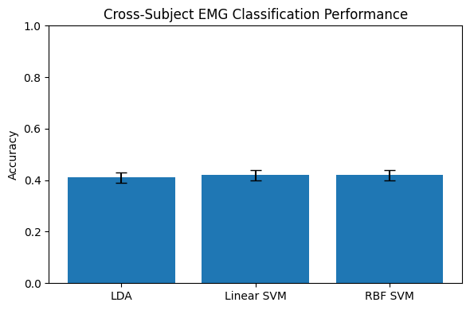
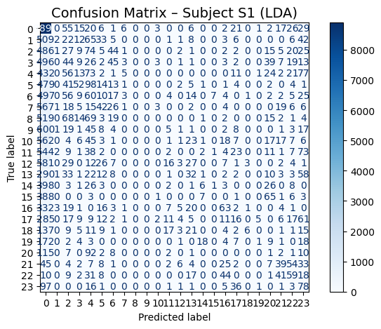

# EMG-Gesture-Recognition-Analysis

## 📌 Project
This project focuses on **hand gesture recognition from EMG signals**.  
Simple time-domain features were extracted and **LDA & SVM (linear and RBF)** classifiers were evaluated using a **Leave-One-Subject-Out (LOSO)** approach to study how EMG signals vary across different subjects.

---

## 🧩 Dataset
- **DB1**  
- **7 subjects** (S1–S7)  
- Multiple sessions per subject  
- **Sampling rate:** 200 Hz  

---

## 🔬 Processing Pipeline
1. **Band-pass filter:** 20–45 Hz  
2. **Segmentation:**  
   - Window: 200 ms  
   - Step: 100 ms  
3. **Features (per channel):**  
   - MAV, RMS, WL, ZC  
   - Total: 40 features

---

## 🤖 Models & Evaluation
- LDA  
- Linear SVM  
- RBF SVM  

All models are **standardized** and evaluated using **LOSO**.

---

## 📊 Results

| Model | Average Accuracy | Std Dev |
|-------|-----------------|---------|
| LDA   | 0.41            | 0.02    |
| **Linear SVM** | **0.42** | 0.02 |
| RBF SVM | 0.42          | 0.02 |

---

## 🧠 Key Points
- More complex models do not always perform better  
- Inter-subject variability is the main challenge in EMG gesture recognition  
- Linear SVM was the most stable model

---

## 📊 Confusion Matrix Example
Here is the confusion matrix for **Subject S1 using LDA**:

---

## 🔗 Run Online (Colab)
You can try the code and run the analysis in Colab:

[**Open in Colab**](https://colab.research.google.com/github/ali-mohamadpour/EMG-Gesture-Recognition-Analysis/blob/main/emg_cross_subject_classification.ipynb)

---

## 📁 File Structure
EMG-Gesture-Recognition-Analysis/
│
├── emg_cross_subject_classification.ipynb
├── img/
        ├── results_accuracy.png
        ├── confusion_matrix_S1.png
├── README.md
└── DB1/
